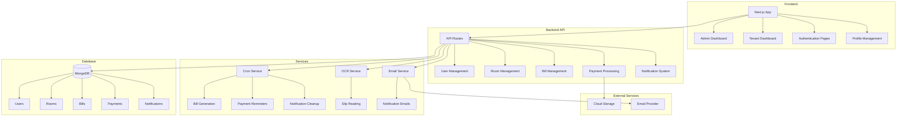
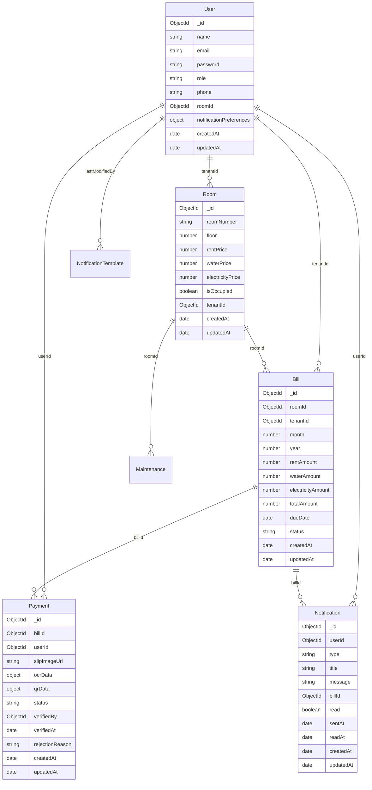

# Bill Mate - แผนการพัฒนาระบบจัดการค่าเช่าหอพัก

## ภาพรวมของระบบปัจจุบัน

หลังจากศึกษาโค้ดทั้งหมด พบว่า Bill Mate เป็นระบบจัดการค่าเช่าหอพักที่สร้างด้วย Next.js 15 และ MongoDB มีโครงสร้างที่ดีและฟีเจอร์พื้นฐานค่อนข้างครบถ้วน แต่ยังมีบางส่วนที่ต้องพัฒนาเพิ่มเติมเพื่อให้ใช้งานได้จริงในระดับ production

### สิ่งที่พร้อมใช้งานแล้ว ✅

1. **ระบบ Authentication**: NextAuth.js พร้อม session management
2. **Database Models**: User, Room, Bill, Payment, Notification, NotificationTemplate, Maintenance (MongoDB + Mongoose)
3. **API Endpoints**: CRUD สำหรับทุก entity
4. **UI Layout**: Admin/Tenant layouts พร้อม sidebar navigation
5. **Core Components**: Navbar, UserForm, RoomForm, SlipReader, PaymentUploadForm
6. **Services**: OCR (Tesseract.js), QR Code (jsQR), Email (Nodemailer)
7. **Security**: Rate limiting, security headers, input validation

### ปัญหาและสิ่งที่ต้องแก้ไข ❌

1. **Database Connection**: ยังไม่มีการ initialize database ใน app startup
2. **Cron Service**: ไฟล์ `cronService.ts` หายไป ทำให้ระบบตั้งเวลาไม่ทำงาน
3. **Profile Management**: ยังไม่มีหน้าจัดการโปรไฟล์ผู้ใช้
4. **Notification UI**: ยังไม่มีหน้าแสดง notifications
5. **File Storage**: ยังใช้ Base64 ซึ่งไม่เหมาะกับ production
6. **Room Assignment**: ยังไม่มีระบบมอบหมายห้องให้ผู้เช่า
7. **Analytics**: ยังไม่มี dashboard สำหรับสถิติต่างๆ

## แผนการพัฒนาโดยละเอียด

### ระยะที่ 1: Infrastructure & Core Systems (Priority: High)

#### 1.1 Database Connection Initialization
- **ปัญหา**: แต่ละ API route ต้องเรียก `connectDB()` แยกกัน ไม่มีการ initialize ตอน app start
- **วิธีแก้**: 
  - สร้าง database connection pool ใน `src/lib/mongodb.ts`
  - เพิ่ม initialization ใน `src/app/layout.tsx` หรือ middleware
  - เพิ่ม connection retry logic
- **ไฟล์ที่ต้องแก้ไข**:
  - `src/lib/mongodb.ts` - เพิ่ม connection pooling
  - `src/app/layout.tsx` - เพิ่ม database initialization
  - `src/middleware.ts` - เพิ่ม connection check

#### 1.2 Cron Service Implementation
- **ปัญหา**: `src/services/cronService.ts` หายไป ทำให้ระบบตั้งเวลาไม่ทำงาน
- **วิธีแก้**:
  - สร้างไฟล์ cronService.ts ใหม่
  - Implement jobs: payment reminders, bill generation, notification cleanup
  - ใช้ node-cron library สำหรับ scheduling
  - เพิ่ม error handling และ retry mechanisms
- **ไฟล์ที่ต้องสร้าง**:
  - `src/services/cronService.ts` - cron job implementations
- **Dependencies**: `npm install node-cron @types/node-cron`

#### 1.3 Error Handling Enhancement
- **ปัญหา**: Error handling ยังไม่สมบูรณ์
- **วิธีแก้**:
  - ปรับปรุง `src/lib/errorHandling.ts`
  - เพิ่ม global error boundary
  - สร้าง standardized error responses
  - เพิ่ม logging system
- **ไฟล์ที่ต้องแก้ไข**:
  - `src/lib/errorHandling.ts` - เพิ่ม error handling utilities
  - `src/app/components/ErrorBoundary.tsx` - ปรับปรุง error boundary
  - สร้าง `src/lib/logger.ts` - logging system

### ระยะที่ 2: User Management & Profile System (Priority: High)

#### 2.1 Profile Management
- **สิ่งที่ต้องสร้าง**:
  - `src/app/profile/page.tsx` - หน้าแสดง/แก้ไขโปรไฟล์
  - `src/app/api/profile/route.ts` - API สำหรับจัดการโปรไฟล์
  - เพิ่มฟีเจอร์: แก้ไขข้อมูลส่วนตัว, เปลี่ยนรหัสผ่าน, ตั้งค่า notifications
- **Features ที่ต้องมี**:
  - แสดงข้อมูลโปรไฟล์ (name, email, phone, role)
  - แก้ไขข้อมูลส่วนตัว (name, phone)
  - เปลี่ยนรหัสผ่าน (old password, new password, confirm)
  - ตั้งค่า notification preferences
  - Validation และ error handling

#### 2.2 Notification Preferences
- **สิ่งที่ต้องทำ**:
  - Implement notification preferences ใน User model (มีอยู่แล้วใน `src/models/User.ts`)
  - สร้าง UI สำหรับจัดการ preferences
  - เชื่อมต่อกับ notification service
- **Features**:
  - Email vs in-app settings
  - Frequency settings
  - Quiet hours
  - Per-notification-type preferences

### ระยะที่ 3: Room Management Enhancement (Priority: High)

#### 3.1 Room Assignment System
- **สิ่งที่ต้องสร้าง**:
  - `src/app/components/RoomAssignmentForm.tsx`
  - `src/app/api/rooms/[id]/assign/route.ts`
- **Features**:
  - Assign tenant to room
  - Move tenant between rooms
  - Room checkout process
  - Rental agreement upload
  - Move-in/move-out dates

#### 3.2 Room Statistics Dashboard
- **สิ่งที่ต้องสร้าง**:
  - `src/app/admin/rooms/stats/page.tsx`
  - `src/app/api/rooms/stats/route.ts`
- **Features**:
  - Occupancy rate by month
  - Revenue per room
  - Average rental period
  - Room maintenance tracking
  - Visual charts and graphs

### ระยะที่ 4: Payment & Billing System (Priority: High)

#### 4.1 Automated Bill Generation
- **สิ่งที่ต้องทำ**:
  - Implement `src/services/billService.ts` ให้ทำงานได้จริง
  - เชื่อมต่อกับ cron job สำหรับสร้างบิลรายเดือน
  - เพิ่ม manual bill creation
- **Features**:
  - Auto-generate monthly bills
  - Manual bill creation
  - Bill adjustments
  - Bill templates
  - Bulk bill generation

#### 4.2 File Storage Optimization
- **ปัญหา**: ใช้ Base64 สำหรับเก็บรูปภาพ ไม่เหมาะกับ production
- **วิธีแก้**:
  - Implement AWS S3 หรือ cloud storage
  - ปรับปรุง `src/app/api/payments/upload/route.ts`
  - เพิ่ม image compression และ CDN
- **Dependencies**: `@aws-sdk/client-s3` (มีอยู่แล้ว)
- **Features**:
  - Replace Base64 with cloud storage
  - Image compression
  - CDN integration
  - Backup and recovery

### ระยะที่ 5: Notification System (Priority: Medium)

#### 5.1 Notification UI
- **สิ่งที่ต้องสร้าง**:
  - `src/app/notifications/page.tsx`
  - `src/app/api/notifications/[id]/route.ts`
- **Features**:
  - Display all notifications
  - Filter by type and status
  - Mark as read/unread
  - Delete notifications
  - Link to related bills/payments

#### 5.2 Admin Notification Panel
- **สิ่งที่ต้องสร้าง**:
  - `src/app/admin/notifications/page.tsx`
  - `src/app/api/notifications/stats/route.ts`
- **Features**:
  - Notification statistics
  - Manual trigger notifications
  - Cron job status monitoring
  - Notification logs
  - Email templates management

#### 5.3 Email Template Management
- **สิ่งที่ต้องสร้าง**:
  - `src/app/admin/notifications/templates/page.tsx`
  - `src/app/api/notifications/templates/route.ts`
- **Features**:
  - Editable email templates
  - Template variables
  - Preview functionality
  - A/B testing support

### ระยะที่ 6: Analytics & Reporting (Priority: Medium)

#### 6.1 Payment Analytics
- **สิ่งที่ต้องสร้าง**:
  - `src/app/admin/payments/analytics/page.tsx`
  - `src/app/api/payments/analytics/route.ts`
- **Features**:
  - Payment trends
  - Late payment analysis
  - Revenue reports
  - Payment method statistics
  - Visual dashboards

#### 6.2 Maintenance System
- **สิ่งที่ต้องสร้าง**:
  - `src/app/admin/rooms/maintenance/page.tsx`
  - `src/app/api/maintenance/route.ts`
- **Features**:
  - Maintenance requests
  - Repair tracking
  - Cost tracking
  - Maintenance history

## แผนการ Implement แบบ Step-by-Step

### Step 1: แก้ไขปัญหาพื้นฐาน (1-2 วัน)
1. สร้าง `cronService.ts` ใหม่
2. แก้ไข database connection initialization
3. ทดสอบระบบ authentication และ database connection

### Step 2: Implement Core Features (3-4 วัน)
1. Profile management system
2. Room assignment system
3. Automated bill generation

### Step 3: Build UI Components (2-3 วัน)
1. Notification UI
2. Admin panels
3. Statistics dashboards

### Step 4: Optimization & Testing (2-3 วัน)
1. File storage optimization
2. Performance optimization
3. Comprehensive testing

### Step 5: Deployment Preparation (1-2 วัน)
1. Production configuration
2. Documentation
3. Deployment setup

## System Architecture



## Database Schema Relationships



## ข้อเสนอแนะเพิ่มเติม

### 1. Database Optimization
- เพิ่ม indexes สำหรับ queries ที่ใช้บ่อย:
  - `User.email` (มีอยู่แล้ว)
  - `Room.roomNumber` (มีอยู่แล้ว)
  - `Bill.roomId, Bill.month, Bill.year` (compound index)
  - `Payment.billId`, `Payment.userId`
  - `Notification.userId`, `Notification.read`

### 2. Caching Strategy
- Implement Redis หรือใน memory cache สำหรับ:
  - User sessions
  - Room data
  - Bill templates
  - Notification templates

### 3. Monitoring
- เพิ่ม system monitoring:
  - Application performance monitoring (APM)
  - Error tracking (Sentry)
  - Uptime monitoring
  - Database performance monitoring

### 4. Testing
- Implement tests:
  - Unit tests สำหรับ business logic
  - Integration tests สำหรับ API endpoints
  - E2E tests สำหรับ critical user flows
  - Performance tests

### 5. Documentation
- สร้าง documentation:
  - API documentation (Swagger/OpenAPI)
  - User guide
  - Developer documentation
  - Deployment guide

## Dependencies ที่ต้องเพิ่ม

```bash
# สำหรับ cron jobs
npm install node-cron
npm install -D @types/node-cron

# สำหรับ testing
npm install -D jest @testing-library/react @testing-library/jest-dom

# สำหรับ monitoring (optional)
npm install @sentry/nextjs

# สำหรับ caching (optional)
npm install redis
```

## Environment Variables ที่ต้องเพิ่ม

```env
# สำหรับ file storage
AWS_ACCESS_KEY_ID=your_aws_access_key
AWS_SECRET_ACCESS_KEY=your_aws_secret_key
AWS_REGION=your_region
AWS_S3_BUCKET=your_bucket_name

# สำหรับ caching (optional)
REDIS_URL=redis://localhost:6379

# สำหรับ monitoring (optional)
SENTRY_DSN=your_sentry_dsn
```

## สรุป

ระบบ Bill Mate มีโครงสร้างที่ดีและพร้อมจะพัฒนาต่อ การแก้ไขปัญหาพื้นฐานเหล่านี้จะทำให้ระบบสามารถใช้งานได้จริงในระดับ production แผนการพัฒนานี้แบ่งเป็น 6 ระยะ โดยเริ่มจากการแก้ไขปัญหาพื้นฐาน จากนั้นจึงพัฒนาฟีเจอร์หลักๆ และสุดท้ายคือการปรับปรุงประสิทธิภาพและเตรียม deployment

---

**สร้างโดย:** System Architect  
**วันที่:** 23 พฤศจิกายน 2567  
**Version:** 1.0  
**Status:** Ready for Implementation 🚀