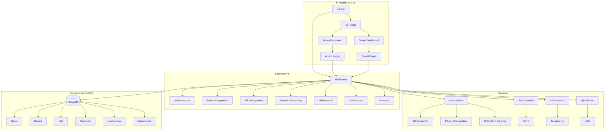
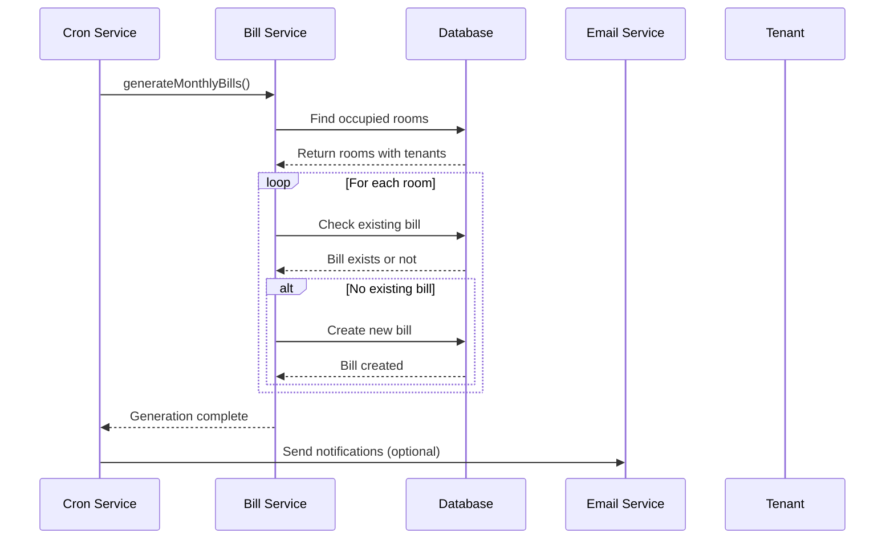
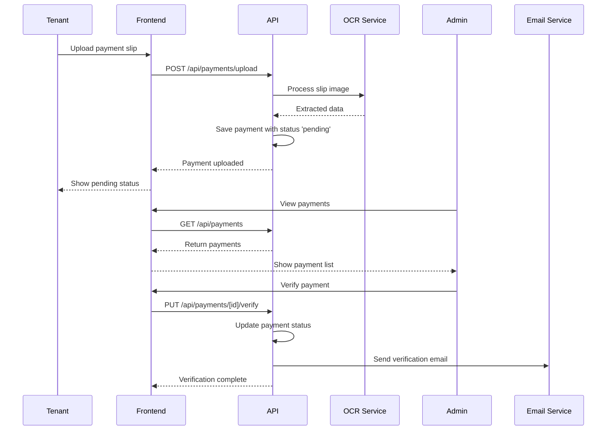
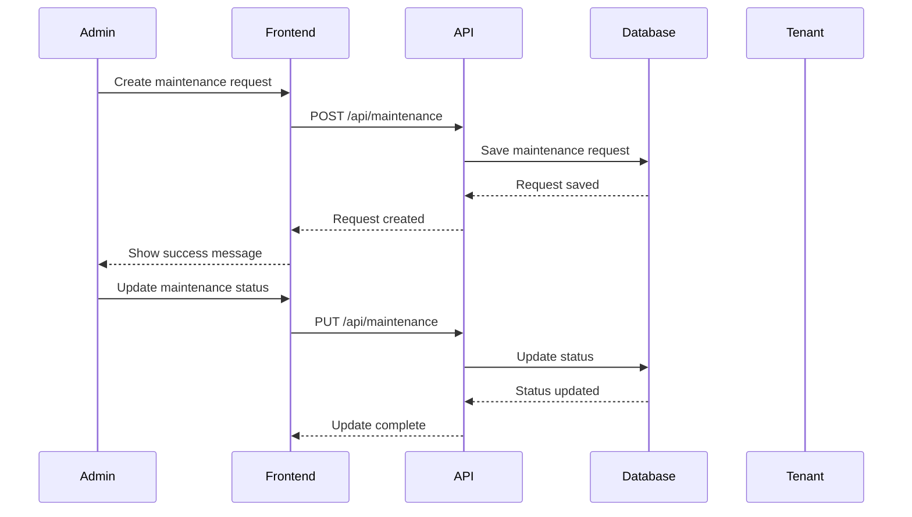

# Bill Mate - คู่มือการทำงานของระบบ (System Flow Documentation)

## ภาพรวมของระบบ

Bill Mate เป็นระบบจัดการค่าเช่าหอพักที่สร้างด้วย Next.js 15 และ MongoDB มีวัตถุประสงค์เพื่อช่วยเจ้าของหอพักในการจัดการห้องพัก ค่าเช่า ค่าน้ำ ค่าไฟ และการตรวจสอบการชำระเงิน

## สถาปัตยกรรมระบบ (System Architecture)



## การทำงานของระบบ (System Flow)

### 1. การเริ่มต้นระบบ (System Initialization)

1. **App Startup** ([`src/app/layout.tsx`](src/app/layout.tsx)):
   - เรียกใช้ `initializeApp()` เพื่อเชื่อมต่อฐานข้อมูล
   - เริ่มต้น Cron Jobs ผ่าน `initializeCronJobs()`
   - ตั้งค่า Session Provider และ Error Boundary

2. **Database Connection** ([`src/lib/mongodb.ts`](src/lib/mongodb.ts)):
   - ใช้ Mongoose เพื่อเชื่อมต่อ MongoDB
   - มีการจัดการ connection pooling และ retry logic

3. **Cron Jobs Initialization** ([`src/services/cronService.ts`](src/services/cronService.ts)):
   - ตั้งเวลาทำงานอัตโนมัติ:
     - แจ้งเตือนการชำระเงิน (5 วันก่อนครบกำหนด)
     - แจ้งเตือนการชำระเงิน (1 วันก่อนครบกำหนด)
     - แจ้งเตือนการชำระเงินเกินกำหนด
     - สร้างบิลรายเดือน (วันที่ 1 ของเดือน)
     - ลบการแจ้งเตือนเก่า (ทุกวันอาทิตย์)

### 2. ระบบ Authentication

1. **Login Process** ([`src/app/(auth)/login/page.tsx`](src/app/(auth)/login/page.tsx)):
   - ผู้ใช้กรอก email และ password
   - ส่งข้อมูลไปยัง NextAuth credentials provider
   - ตรวจสอบข้อมูลกับฐานข้อมูลผ่าน [`src/lib/auth.ts`](src/lib/auth.ts)
   - หากสำเร็จ จะ redirect ไปยัง dashboard ตามบทบาท (admin/tenant)

2. **Session Management** ([`src/lib/auth.ts`](src/lib/auth.ts)):
   - ใช้ JWT strategy สำหรับ session
   - เก็บข้อมูล user id, name, email, และ role
   - มีอายุ 30 วัน

3. **Role-based Access Control**:
   - Admin: เข้าถึงได้ทุกฟังก์ชัน
   - Tenant: เข้าถึงเฉพาะข้อมูลของตัวเอง

### 3. การจัดการห้องพัก (Room Management)

1. **Admin Room Management** ([`src/app/admin/rooms/page.tsx`](src/app/admin/rooms/page.tsx)):
   - ดูรายการห้องทั้งหมด
   - เพิ่ม/แก้ไข/ลบห้องพัก
   - มอบหมายห้องให้ผู้เช่า

2. **Room Assignment** ([`src/app/components/RoomAssignmentForm.tsx`](src/app/components/RoomAssignmentForm.tsx)):
   - เลือกผู้เช่าสำหรับห้อง
   - กำหนดวันที่เข้าอยู่
   - อัปเดตสถานะห้อง (isOccupied)

### 4. ระบบบิล (Billing System)

1. **Automatic Bill Generation** ([`src/services/billService.ts`](src/services/billService.ts)):
   - Cron job ทำงานวันที่ 1 ของเดือน
   - สร้างบิลสำหรับห้องที่มีผู้เช่าทุกห้อง
   - คำนวณค่าเช่า + ค่าน้ำ + ค่าไฟ
   - กำหนดวันครบกำหนด (default 5 วันของเดือนถัดไป)

2. **Manual Bill Creation** ([`src/app/admin/bills/generate/page.tsx`](src/app/admin/bills/generate/page.tsx)):
   - Admin สามารถสร้างบิลแบบ manual
   - เลือกเดือน/ปี และห้องที่ต้องการ

3. **Bill Display**:
   - Admin: ดูบิลทั้งหมดในระบบ
   - Tenant: ดูเฉพาะบิลของตัวเอง

### 5. ระบบการชำระเงิน (Payment System)

1. **Payment Upload** ([`src/app/components/PaymentUploadForm.tsx`](src/app/components/PaymentUploadForm.tsx)):
   - Tenant อัปโหลดรูปสลิปโอนเงิน
   - ระบบอ่านข้อมูลจากสลิปผ่าน OCR (Tesseract.js)
   - ตรวจสอบ QR Code ด้วย jsQR

2. **Payment Verification** ([`src/app/admin/payments/page.tsx`](src/app/admin/payments/page.tsx)):
   - Admin ตรวจสอบการชำระเงิน
   - ยืนยัน/ปฏิเสธการชำระ
   - บันทึกเหตุผลการปฏิเสธ

3. **Payment Status Flow**:
   - Pending: รอการตรวจสอบ
   - Verified: ยืนยันแล้ว
   - Rejected: ถูกปฏิเสธ

### 6. ระบบแจ้งซ่อม (Maintenance System)

1. **Maintenance Request** ([`src/app/admin/rooms/maintenance/page.tsx`](src/app/admin/rooms/maintenance/page.tsx)):
   - สร้างรายการแจ้งซ่อม
   - ระบุหมวดหมู่ ความสำคัญ และรายละเอียด
   - มอบหมายให้ช่าง/ผู้รับผิดชอบ

2. **Maintenance Status**:
   - Pending: รอดำเนินการ
   - In-progress: กำลังดำเนินการ
   - Completed: เสร็จสิ้น
   - Cancelled: ยกเลิก

3. **Maintenance Analytics** ([`src/app/admin/maintenance/analytics/page.tsx`](src/app/admin/maintenance/analytics/page.tsx)):
   - วิเคราะห์ข้อมูลการแจ้งซ่อม
   - ติดตามค่าใช้จ่าย
   - วิเคราะห์เวลาดำเนินการ

### 7. ระบบแจ้งเตือน (Notification System)

1. **In-App Notifications** ([`src/app/components/NotificationDropdown.tsx`](src/app/components/NotificationDropdown.tsx)):
   - แสดงการแจ้งเตือนใน Navbar
   - แยกตามประเภท (payment_reminder, overdue, payment_verified, etc.)
   - ทำเครื่องหมายว่าอ่านแล้ว/ยังไม่ได้อ่าน

2. **Email Notifications** ([`src/lib/email.ts`](src/lib/email.ts)):
   - ส่งอีเมลแจ้งเตือนผ่าน Nodemailer
   - แจ้งเตือนก่อนครบกำหนด
   - แจ้งเตือนเมื่อชำระเงินเกินกำหนด
   - ยืนยันการชำระเงิน

3. **Notification Types**:
   - Payment Reminder: แจ้งเตือนก่อนครบกำหนด
   - Overdue: แจ้งเตือนเมื่อเกินกำหนด
   - Payment Verified: ยืนยันการชำระเงิน
   - Payment Rejected: แจ้งเตือนเมื่อถูกปฏิเสธ

### 8. ระบบวิเคราะห์ข้อมูล (Analytics System)

1. **Payment Analytics** ([`src/app/admin/payments/analytics/page.tsx`](src/app/admin/payments/analytics/page.tsx)):
   - วิเคราะห์รายรับรายเดือน
   - สถิติการชำระเงิน (pending/verified/rejected)
   - วิเคราะห์การชำระล่าช้า
   - แนวโน้มการชำระเงิน

2. **Maintenance Analytics** ([`src/app/admin/maintenance/analytics/page.tsx`](src/app/admin/maintenance/analytics/page.tsx)):
   - วิเคราะห์การแจ้งซ่อมตามหมวดหมู่
   - ติดตามค่าใช้จ่ายในการซ่อมแซม
   - วิเคราะห์เวลาดำเนินการ
   - ห้องที่แจ้งซ่อมบ่อยที่สุด

## การไหลของข้อมูล (Data Flow)

### 1. การสร้างบิลรายเดือน (Monthly Bill Generation Flow)



### 2. การชำระเงิน (Payment Flow)



### 3. การแจ้งซ่อม (Maintenance Flow)



## โครงสร้างฐานข้อมูล (Database Schema)

### 1. Users Collection
```javascript
{
  _id: ObjectId,
  name: String,
  email: String,
  password: String, // bcrypt hash
  role: String, // 'admin' | 'tenant'
  phone: String,
  roomId: ObjectId, // Reference to Room
  notificationPreferences: Object,
  createdAt: Date,
  updatedAt: Date
}
```

### 2. Rooms Collection
```javascript
{
  _id: ObjectId,
  roomNumber: String,
  floor: Number,
  rentPrice: Number,
  waterPrice: Number,
  electricityPrice: Number,
  isOccupied: Boolean,
  tenantId: ObjectId, // Reference to User
  createdAt: Date,
  updatedAt: Date
}
```

### 3. Bills Collection
```javascript
{
  _id: ObjectId,
  roomId: ObjectId, // Reference to Room
  tenantId: ObjectId, // Reference to User
  month: Number,
  year: Number,
  rentAmount: Number,
  waterAmount: Number,
  electricityAmount: Number,
  totalAmount: Number,
  dueDate: Date,
  status: String, // 'pending' | 'paid' | 'overdue' | 'verified'
  createdAt: Date,
  updatedAt: Date
}
```

### 4. Payments Collection
```javascript
{
  _id: ObjectId,
  billId: ObjectId, // Reference to Bill
  userId: ObjectId, // Reference to User
  slipImageUrl: String,
  ocrData: Object, // Extracted from slip
  qrData: Object, // Extracted from slip
  status: String, // 'pending' | 'verified' | 'rejected'
  verifiedBy: ObjectId, // Reference to User
  verifiedAt: Date,
  rejectionReason: String,
  createdAt: Date,
  updatedAt: Date
}
```

### 5. Notifications Collection
```javascript
{
  _id: ObjectId,
  userId: ObjectId, // Reference to User
  type: String, // 'payment_reminder' | 'overdue' | 'payment_verified' | etc.
  title: String,
  message: String,
  billId: ObjectId, // Reference to Bill (optional)
  read: Boolean,
  sentAt: Date,
  readAt: Date,
  createdAt: Date,
  updatedAt: Date
}
```

### 6. Maintenance Collection
```javascript
{
  _id: ObjectId,
  roomId: ObjectId, // Reference to Room
  tenantId: ObjectId, // Reference to User (optional)
  category: String, // 'electrical' | 'plumbing' | 'air-conditioning' | etc.
  title: String,
  description: String,
  priority: String, // 'low' | 'medium' | 'high' | 'urgent'
  status: String, // 'pending' | 'in-progress' | 'completed' | 'cancelled'
  reportedDate: Date,
  scheduledDate: Date,
  completedDate: Date,
  cost: Number,
  assignedTo: String,
  notes: String,
  images: [String],
  createdBy: {
    userId: ObjectId,
    name: String,
    role: String
  },
  createdAt: Date,
  updatedAt: Date
}
```

## การรักษาความปลอดภัย (Security Measures)

1. **Authentication & Authorization**:
   - NextAuth.js สำหรับการจัดการ session
   - Role-based access control (RBAC)
   - JWT tokens สำหรับ session

2. **Input Validation**:
   - Server-side validation สำหรับทุก API endpoint
   - Client-side validation สำหรับ user experience

3. **Rate Limiting** ([`src/middleware.ts`](src/middleware.ts)):
   - จำกัดคำขอตามประเภท (auth, API, file upload)
   - ป้องกันการโจมตีแบบ brute force

4. **Security Headers**:
   - CORS headers
   - XSS protection
   - Content Security Policy
   - Frame protection

5. **Data Protection**:
   - Password hashing ด้วย bcrypt
   - Secure file upload handling
   - Input sanitization

## การจัดการข้อผิดพลาด (Error Handling)

1. **Global Error Boundary** ([`src/app/components/ErrorBoundary.tsx`](src/app/components/ErrorBoundary.tsx)):
   - จัดการ errors ใน React components
   - แสดง error page ที่เป็นมิตรกับผู้ใช้

2. **API Error Handling**:
   - Standardized error responses
   - Proper HTTP status codes
   - Error logging

3. **Logging System** ([`src/lib/logger.ts`](src/lib/logger.ts)):
   - Structured logging
   - Different log levels
   - Error tracking

## การปรับปรุงประสิทธิภาพ (Performance Optimization)

1. **Database Optimization**:
   - Proper indexing สำหรับ queries ที่ใช้บ่อย
   - Connection pooling
   - Query optimization

2. **Caching Strategy**:
   - Session caching
   - Data caching สำหรับข้อมูลที่ใช้บ่อย
   - Image optimization

3. **Frontend Optimization**:
   - Lazy loading
   - Code splitting
   - Image optimization

## การขยายระบบ (Scalability Considerations)

1. **Database Scaling**:
   - MongoDB Atlas สำหรับ production
   - Read replicas สำหรับ analytics
   - Proper indexing strategy

2. **File Storage**:
   - Cloud storage (AWS S3) สำหรับรูปภาพ
   - CDN integration
   - Image compression

3. **Monitoring**:
   - Application performance monitoring
   - Error tracking
   - Uptime monitoring

## สรุปการทำงานของระบบ

Bill Mate เป็นระบบที่ครอบคลุมทุกด้านของการจัดการหอพัก ตั้งแต่การจัดการห้องพัก การสร้างบิล การตรวจสอบการชำระเงิน ไปจนถึงการวิเคราะห์ข้อมูล ระบบถูกออกแบบมาให้ใช้งานง่าย มี UI ที่เป็นมิตรกับผู้ใช้ และมีฟีเจอร์ครบถ้วนสำหรับทั้งเจ้าของหอและผู้เช่า

ระบบมีการแยกบทบาทที่ชัดเจน มีการรักษาความปลอดภัยที่เหมาะสม และมีการวิเคราะห์ข้อมูลที่ช่วยในการตัดสินใจ ทำให้เป็นเครื่องมือที่มีประสิทธิภาพสำหรับการจัดการหอพักในยุคดิจิตัล